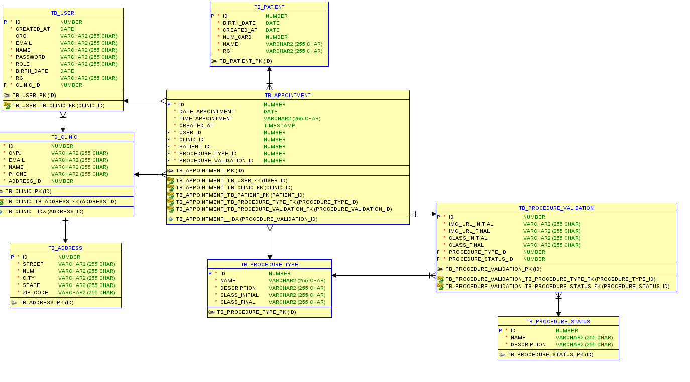

# Odonto Validation

Serviço de Validação de Consultas Odontológicas

### Link p/ apresentação da solução: https://www.youtube.com/watch?v=DnxCKNGBdL8

## Integrantes do Grupo

### Kauã Almeida Silveira
- **Responsável por:** API em Java Spring Boot, integração com o banco de dados Oracle, e API Python com Roboflow para visão computacional.
### Rafael Vida
- **Responsável por:** DevOps no Azure e QA, garantindo o pipeline de integração contínua e a qualidade do software.
### Gustavo Maia
- **Responsável por:** Desenvolvimento do App em Kotlin para Android e site em C#.

## Descrição do Projeto

AVISO: O recurso de IA utiliza o CLI do GCP, logo é necessário ter o GCP instalado e configurado na máquina, com a conta configurada, neste caso somente a minha, e o projeto ativo.

Projeto de validação de consultas odontológicas desenvolvido para a OdontoPrev. O objetivo é combater sinistros e fraudes em atendimentos odontológicos por meio de visão computacional, capturando imagens no início e no fim dos procedimentos. A validação é feita por um aplicativo mobile utilizado exclusivamente pelo dentista responsável, garantindo mais segurança e controle.

A aplicação é composta por uma API em Java Spring Boot, app mobile em Kotlin e modelos de visão computacional integrados via Python e Roboflow. O banco de dados Oracle garante consistência das informações e segurança nas validações. A solução é pensada para se integrar ao fluxo atual de atendimentos, com mínima fricção para os profissionais.

### Viabilidade da Solução

- **Tecnológica**: Uso de ferramentas consolidadas e escaláveis como Spring Boot, Kotlin e Oracle.
- **Operacional**: Processo simples e rápido para os dentistas, com mínima interferência no atendimento.
- **Econômica**: Redução de custos com auditorias e sinistros, aproveitando tecnologias já disponíveis.

### Pertinência da Solução Entregue

- **Alinhamento com a dor do cliente**: Foco direto na prevenção de fraudes e sinistros.
- **Ganho em confiabilidade**: Evidências visuais e validação autenticada reforçam a veracidade dos atendimentos.
- **Aplicabilidade real**: Adaptação prática ao fluxo da rede credenciada, com adoção viável no dia a dia.


Obs: Vale ressaltar que o Aplicativo é direcionado aos dentistas e atendentes/recepcionistas.

GITHUB REPOSITÓRIO DO PROJETO JAVA MVC: https://github.com/ChallengeOdontoPrev/javaAdvancedMVC

GITHUB REPOSITÓRIOS DA SOLUÇÃO: https://github.com/orgs/ChallengeOdontoPrev/repositories

## Instruções para Rodar a Aplicação

## Pré-requisitos para rodar a API Spring Boot:
- Java 21 ou superior instalado (para a API Spring Boot)
- Maven instalado (para a API Spring Boot)
- As configurações do banco de dados Oracle estão no arquivo `application-dev.properties` na pasta `src/main/resources`,
  não é necessário instalar o banco de dados Oracle, pois a aplicação está utilizando um banco de dados disponibilizado
  em um servidor remoto da FIAP.

## Passo a Passo:

1. **Clone o repositório:**
   ```git clone https://github.com/ChallengeOdontoPrev/javaAdvancedMVC.git```
2. **Acesse a pasta do projeto no intellij:**
3. **Defina o JDK no Intellij para Run & build do projeto**
4. **Rode a aplicação Spring Boot, localizada na pasta raiz**
   ```ChallengeJavaApplication.java```

## Diagrama de Entidade-Relacionamento (DER)


